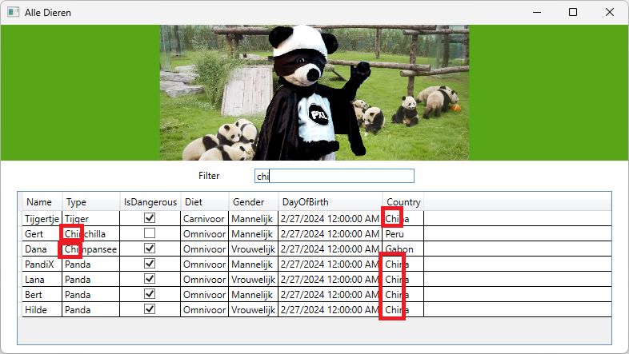

# Pandapark

Maak een desktoptoepassing in C# voor de nieuwe dierentuin van de PXL.
Sinds de

aankomst van de nieuwe mascotte, **PandiX**, heeft de directie van de
PXL besloten dat de

hogeschool nood heeft aan levende panda's in de buurt van de
lesgebouwen.

Er zijn echter niet genoeg panda's beschikbaar om te huren van China
waardoor de PXL

genoodzaakt is om ook andere dieren aan te kopen. Zorg ervoor dat de
dieren uit het bestand "diereninventaris.csv" automatisch uitgelezen
kunnen worden en getoond worden in de applicatie.

## Data

● Voorzie drie klasses waarin de dieren in kunnen worden
gedigitaliseerd, Animal, Bird en Mammal.

● Zorg er voor dat je geen instantie kan aanmaken van de klasse Animal.

● Voorzie een interface CSVable die de methode ToCSV bevat.

● Implementeer de methode ToCSV die een klasse kan omzetten naar een
stuk tekst waarin de waardes van de properties onderscheiden worden door
puntkomma's, ";".

● Zorg er voor dat er een minimale hoeveelheid aan duplicate code is
binnen de klasses.

● De klasse Mammel heeft een property IsInfant die read-only is. De
waarde van deze property wordt bepaald door de geboortedatum van het
dier. Indien het dier 365 dagen of minder oud is dan geeft de property
true terug, anders geeft deze false terug.

● De Klasse Animal heeft twee read-only properties: HijOfZij en
ZijnOfHaar die hij of zij en zijn of haar teruggeven op basis van het
geslacht van het dier. Deze properties zijn enkel toegankelijk binnen de
klasse en alle klasses die er van overerven.

● De methode Describe beschrijft het dier in een zin en gebruikt de
properties HijOfZij en ZijnOfHaar om de zin dynamisch op te bouwen.

○ De beschrijving van een vogel bevat: de **naam**, het **type**, het
**nest type** en de **spanwijdte** van de vleugels.

○ De beschrijving van een zoogdier bevat: de **naam**, het **type**, of
het een **infant is** en het **geboorteland**.

○ In de Describe methode moet je geen rekening houden met het geslacht
van de woorden (bv: **het** paard vs **de** aap). Je mag altijd **DE**
gebruiken.

## Settings:

● Voorzie een static klasse Settings met een property die read-only is
en de naam van het CSV bestand teruggeeft, \"diereninventaris.csv\".

● Gebruik de property AnimalCSV doorheen de applicatie om de naam van
het bestand op te vragen.

## diereninventaris.csv:

● In het csv bestand diereninventaris worden alle dieren van het
pandapark opgeslagen. De eerste waarde in elke regel is een "B" of een
"M" om aan te geven of het dier een "B" = Bird of een "M" = Mammal is.

## Windows:

Binnen de applicatie worden vijf verschillende vensters gebruikt.
Gebruik de voorziene XAML om deze vensters aan te maken in je project.

● Voeg de afbeeldingen toe aan de vensters.

● Je mag de XAML van de vensters aanpassen indien nodig. Je zal de
bijvoorbeeld sommige besturingselementen een naam moeten geven om er
gegevens van op te vragen.

### MainWindow - Pandapark Manager (zie afbeelding 1)

● Implementeer de navigatie op het startscherm naar de overige vier
vensters.

> o De "Alle Dieren"-knop navigeert naar het venster AllAnimals. Wanneer
> de gebruiker het AllAnimals venster open heeft, kan hij of zij
> **niet** meer een interactie uitvoeren op MainWindow.
>
> o De "Zoogdier Toevoegen"-knop navigeert naar het venster AddMammal.
> Wanneer de gebruiker het AddMammal venster open heeft, kan hij of zij
> **niet** meer een interactie uitvoeren op MainWindow.
>
> o De "Vogel Toevoegen"-knop navigeert naar het venster AddBird.
> Wanneer de gebruiker het AddBird venster open heeft, kan hij of zij
> **niet** meer een interactie uitvoeren op MainWindow.
>
> o De "Help"-knop navigeert naar het venster Help. Wanneer de gebruiker
> het Help venster open heeft, kan hij of zij **nog steeds** interacties
> uitvoeren op MainWindow.

● Voorzie een zoekfunctie die alle dieren evalueert op basis van de naam
die getypt wordt in de TextBox boven de zoek-knop. Wanneer je minstens
één dier vindt met de gegeven naam, dan verschijnt er een beschrijving
van het eerst gevonden dier onder de zoek-knop.

● De beschrijving van het dier wordt gedefinieerd in de klasse van het
dier zelf in de methode Describe().

***Afb2: Voorbeelden van een beschrijving***

● Wanneer de vogel de grootste of kleinste vleugel spanwijdte heeft, dan
wordt dit extra vermeld. Doe deze evaluatie met een **LINQ** query.

***Afb3: Voorbeeld van kleinste spanwijdte***

### AllAnimals - Alle Dieren

**Afb4: Alle dieren overzicht**

● Voorzie het inladen van een lijst van alle dieren uit de csv in
MainWindow en geef het resultaat door aan AllAnimals.

● Koppel de lijst aan het DataGrid door de ItemSource property gelijk te
stellen aan de List van Animal objecten.

● Voorzie een filterfunctie die de lijst filtert op basis van de tekst
die wordt ingegeven in de TextBox op het venster. Zolang als de
**ingegeven tekst overeenkomt met een deel van de tekst in de naam, type
of geboorteland**, dan wordt het dier nog getoond in de lijst. De
zoekfunctie is **niet hoofdlettergevoelig**. Gebruik hiervoor een
**LINQ** query.

● Wanneer er geen tekst in de TextBox staat, dan worden alle dieren
getoond.

● Zorg er voor dat het filteren gebeurt zodra iemand de tekst verandert
in de TextBox.

**Afb5: Een filter voorbeeld waarin "chi" voorkomt in het geboorteland
en type van**

**een aantal dieren, maar niet in de naam**

### AddMammal - Zoogdier Toevoegen

**Afb6: Zoogdier Toevoegen in start status**

● Wanneer de gebruiker op de "Voeg Zoogdier Toe"-knop klikt, dan worden
de ingevulde gegevens gebruikt om een nieuw zoogdier toe te voegen aan
de diereninventaris.csv.

● Voorzie een restrictie die voorkomt dat een dier toegevoegd wordt
terwijl één van de velden niet ingevuld is of enkel white space bevat.

● Wanneer een gebruiker succesvol een dier heeft toegevoegd, dan worden
alle velden terug gereset naar hun start status.

● ***Tip:*** Je kan de property SelectedDate gebruiken om de DateTime
uit de DatePicker te halen.

### AddBird - Vogel Toevoegen

**Afb7: Vogel Toevoegen in start status**

● Wanneer de gebruiker op de "Voeg Vogel Toe"-knop klikt, dan worden de
ingevulde gegevens gebruikt om een nieuwe vogel toe te voegen aan de
diereninventaris.csv.

● Voorzie een restrictie die voorkomt dat een dier toegevoegd wordt
terwijl één van de velden niet ingevuld is of enkel white space bevat.

● De ingegeven WingSpan moet een geldig getal zijn.

● Wanneer een gebruiker succesvol een dier heeft toegevoegd, dan worden
alle velden terug gereset naar hun start status.

● ***Tip:*** Je kan de property SelectedDate gebruiken om de DateTime
uit de DatePicker

te halen.

### Help:

● Wanneer de gebruiker op de "OK"-knop klikt, dan wordt het Help venster
gesloten.

## Klassendiagram:

● Maak een klassendiagram aan van je project en noem deze

"ClassDiagramPandapark.cd".
